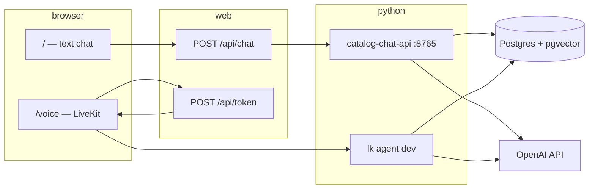

# Game Guide (voice-agent)

A **video game recommendation assistant** backed by a large Postgres catalog (~190k+ titles), with **streaming text chat** on the web and **real-time voice** via LiveKit. The same catalog tools power both channels.

| Package | Role |
|---------|------|
| [`catalog/`](catalog/) | Postgres schema, ingest, embeddings, semantic search, **text chat API** |
| [`agent/`](agent/) | LiveKit Python voice agent (**Game Guide** persona + catalog tools) |
| [`web/`](web/) | Next.js UI — home + text chat, `/voice` for WebRTC voice |
| [`db/init/`](db/init/) | SQL migrations (pgvector) applied on first `docker compose up` |

---

## Architecture



**Catalog tools** (shared by text and voice): `search_games`, `search_similar_games`, `get_game_details`.

---

## Prerequisites

- [Docker](https://docs.docker.com/get-docker/) — local Postgres (port **5434** by default)
- [uv](https://docs.astral.sh/uv/) — Python for `catalog/` and `agent/`
- **Node.js 20+** — `web/` (npm or pnpm)
- [LiveKit CLI](https://docs.livekit.io/intro/basics/cli/) (`lk`) — voice agent only
- **OpenAI API key** — text chat, voice LLM path, and embeddings
- Optional API keys for **re-ingest** (IGDB/Twitch, RAWG, Steam, GameBrain) — see [`.env.example`](.env.example)

---

## Configuration

Copy the example env file at the **repo root** and fill in secrets:

```bash
cp .env.example .env.local
```

Minimum for **text chat**:

- `DATABASE_URL`
- `OPENAI_API_KEY`

For **voice** (`/voice`), also set:

- `LIVEKIT_URL`, `LIVEKIT_API_KEY`, `LIVEKIT_API_SECRET`
- `AGENT_NAME=agent` (default)

The Next app loads env from the **repo root** and `web/` ([`web/lib/env.ts`](web/lib/env.ts)). A symlink `web/.env.local` → `../.env.local` works; you can also keep a single root `.env.local`.

---

## Run locally

Use **separate terminals** from the repo root. Do not run `cd catalog && …` and then `cd web` in the same shell without returning to the root first.

### 1. Database

```bash
docker compose up -d
```

### 2. Text chat (backend + frontend)

```bash
# Terminal A — streaming chat API (default http://127.0.0.1:8765)
cd catalog && uv sync && uv run catalog-chat-api

# Terminal B — Next.js (http://localhost:3000)
cd web && npm install && npm run dev
```

Open **http://localhost:3000** → chat bar or **Open text chat**. No LiveKit required for this path.

If port **8765** is already in use, either use the existing process or free it:

```bash
lsof -i :8765
kill <PID>
```

### 3. Voice (optional)

```bash
# Terminal C — LiveKit agent (must match AGENT_NAME in env)
cd agent && lk agent dev
```

Open **http://localhost:3000/voice** and start a voice session.

---

## Catalog CLI

From `catalog/` after `uv sync`:

| Command | Purpose |
|---------|---------|
| `uv run catalog-db` | DB utilities / schema helpers |
| `uv run catalog-ingest` | Pull metadata from OpenVGDB, IGDB, RAWG, Steam, GameBrain, etc. |
| `uv run catalog-embed` | Generate `game_chunk` embeddings (OpenAI) for semantic search |
| `uv run catalog-chat-api` | FastAPI SSE server for text chat |

Ingest and embeddings are **one-time / periodic** ops; day-to-day dev only needs Postgres with data already loaded plus `OPENAI_API_KEY` for chat.

```bash
cd catalog && uv run pytest
```

---

## Documentation

| Doc | Contents |
|-----|----------|
| [docs/models/database-schema.md](docs/models/database-schema.md) | Tables, pgvector, ingest model |
| [docs/frontend/README.md](docs/frontend/README.md) | Web app architecture and status |
| [docs/frontend/text-chat-streaming.md](docs/frontend/text-chat-streaming.md) | Text chat API and SSE events |
| [docs/research/game-data-sources.md](docs/research/game-data-sources.md) | Where catalog data comes from |
| [agent/README.md](agent/README.md) | LiveKit agent starter details |
| [web/README.voice-agent.md](web/README.voice-agent.md) | Web-specific setup notes |

---

## Project status

This repo is a **complete local stack** for Game Guide: catalog + RAG-style search, streaming text UI, and LiveKit voice. Production hardening (auth, hosted chat API, CI, deduped ingest) is left as follow-up work outside this README.

---

## Acknowledgments

- Voice pipeline: [LiveKit Agents](https://github.com/livekit/agents) (see `agent/`)
- Web UI: [agent-starter-react](https://github.com/livekit-examples/agent-starter-react) (see `web/`)
