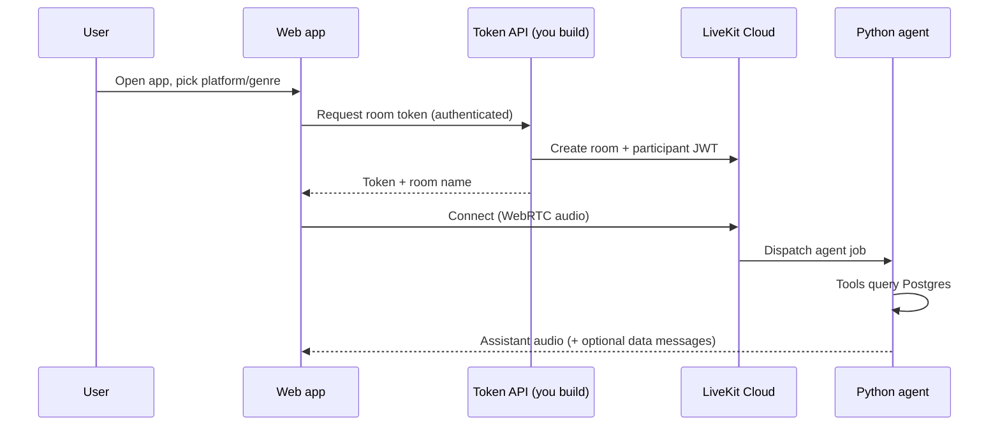

# Frontend — game voice assistant

Discussion doc for the **web (and future mobile) UI** around this repo’s LiveKit voice agent. The backend is **`agent/`** (voice), **`catalog/`** (Postgres + text chat API), and **`web/`** (Next.js).

**Last updated:** 2026-09-25

---

## What we have today

| Layer | Status | Notes |
|--------|--------|--------|
| Voice agent | **Done (local)** | `lk agent console` / `lk agent dev`; agent name **`agent`** |
| Game catalog + RAG | **Done** | ~192k games, embeddings, tools: `search_games`, `search_similar_games`, `get_game_details` |
| Web / mobile UI | **Started** | `web/` — Next.js React app (LiveKit starter + Game Guide shell) |
| Token API | **Done** | `web/app/api/token` + repo `.env.local` |
| Text chat (streaming) | **Done** | `catalog-chat-api` + `web/app/api/chat` — see [text-chat-streaming.md](./text-chat-streaming.md) |

Local dev flow: see the [root README](../../README.md) — Postgres, `catalog-chat-api`, `npm run dev` in `web/`, and optionally `lk agent dev` for voice.

---

## How a frontend fits in



**Important:** The frontend **never** talks to Postgres or OpenAI directly. It only:

1. Obtains a **short-lived LiveKit token** from your backend.
2. Joins a **room** and streams **microphone audio**.
3. Optionally renders **transcripts**, **UI state**, and **structured game results** if we add them later.

Secrets (`DATABASE_URL`, `OPENAI_API_KEY`, `LIVEKIT_API_SECRET`) stay on the **agent** and **token service** only.

---

## Recommended starting points (LiveKit)

| Goal | Starter | Link |
|------|---------|------|
| Full web app (Next.js + React) | agent-starter-react | [livekit-examples/agent-starter-react](https://github.com/livekit-examples/agent-starter-react) |
| Embeddable widget | agent-starter-embed | [livekit-examples/agent-starter-embed](https://github.com/livekit-examples/agent-starter-embed) |
| Docs hub | Frontends guide | [docs.livekit.io/frontends](https://docs.livekit.io/frontends/) |

**Suggested default for this project:** **`agent-starter-react`** in a sibling folder (e.g. `web/`) or its own repo, configured to dispatch agent **`agent`** on the same LiveKit project as `agent/.env.local`.

---

## Product UX (game-specific)

Voice is the primary interface; the UI should **support** conversation, not replace it.

### MVP screens / components

1. **Connect** — “Start talking” + mic permission; connection status (connecting / live / error).
2. **Live transcript** — User + assistant text (LiveKit transcription or agent events).
3. **Quick picks (optional)** — Chips: platform (`PS5`, `Switch`, `PC`) and genre (`RPG`, `Action`) sent as **user text** or **room metadata** so the user does not have to spell slugs.
4. **Recommendations panel (phase 2)** — Cards: title, platform, score, one-line summary. Today tools return **plain text for TTS**; cards need either:
   - **RPC / data channel** from agent with JSON payloads after tool calls, or
   - A small **REST API** (`GET /games/search?platform=ps5&genre=rpg`) that mirrors `catalog/queries.py` for the UI only.

### Room metadata (optional)

`load_call_context()` already reads **room metadata** JSON for `contact_name`, `company_name`, `company_summary`. For games we can extend metadata (frontend sets on join):

```json
{
  "contact_name": "Alex",
  "company_name": "Game Guide",
  "company_summary": "Video game recommendations.",
  "preferred_platform": "ps5"
}
```

Agent instructions can reference `preferred_platform` once we wire it through `CallContext` (small backend change).

---

## Architecture choices to decide

| Topic | Options | Recommendation |
|--------|---------|----------------|
| **Repo layout** | Monorepo `web/` vs separate repo | Monorepo `web/` if one team; separate repo if FE deploys independently |
| **Framework** | Next.js (starter), Vite+React, embed only | Next.js starter for fastest path |
| **Auth** | None (demo), Clerk/Auth0, anonymous + rate limit | Anonymous JWT + rate limit for demo; real auth before production |
| **Token endpoint** | Next.js Route Handler, FastAPI in `api/`, LiveKit Cloud sandbox | Next.js API route colocated with `web/` |
| **Showing game cards** | Text-only vs structured API | Start text-only; add `catalog` HTTP API when UI needs cards |
| **Styling** | Tailwind (starter default), shadcn, etc. | Match starter; theme for “game guide” brand later |

---

## What the frontend does **not** need (v1)

- Direct IGDB / RAWG / Steam calls (catalog is source of truth).
- Embedding generation (batch job only on server).
- Running the Python agent in the browser.

---

## Environment (frontend vs agent)

| Variable | Frontend | Agent |
|----------|----------|-------|
| `LIVEKIT_URL` | Public URL | Yes |
| `LIVEKIT_API_KEY` / `SECRET` | **Only on token server** | Agent worker |
| `DATABASE_URL` | No | Yes |
| `OPENAI_API_KEY` | No | Yes (semantic tool + embed job) |

Frontend typically needs:

- `NEXT_PUBLIC_LIVEKIT_URL` (or equivalent)
- Backend route using server-side `LIVEKIT_API_KEY` + `LIVEKIT_API_SECRET` to mint tokens

---

## Phased plan

### Phase FE-1 — Join and talk

- [x] Add `web/` from **agent-starter-react** (Game Guide branding + sidebar).
- [x] Token API route; connect to local agent (`lk agent dev`, `AGENT_NAME=agent`).
- [ ] Mic + assistant audio + basic transcript.
- [ ] Smoke test: “Best RPGs on PS5?” end-to-end.

### Phase FE-2 — Game UX

- [ ] Platform / genre chips → spoken or sent as metadata.
- [ ] Branding: rename “Game Guide”, icon, short onboarding copy.
- [ ] Mobile-friendly layout (responsive + safe areas).

### Phase FE-3 — Rich results

- [ ] HTTP search API wrapping `catalog.queries` (or LiveKit data messages).
- [ ] Game cards with cover art (future: store URLs / IGDB covers).
- [ ] Share link or save list (local storage or account).

### Phase FE-4 — Production

- [ ] Hosted Postgres reachable from LiveKit Cloud agent (not `localhost`).
- [ ] CI for `web/`; preview deploys.
- [ ] Analytics: session length, tool usage (no PII in logs).

---

## Open questions

1. **Single app or embed?** Marketing site widget vs dedicated “Game Guide” app.
2. **Do we need a written catalog browse** without voice, or voice-only?
3. **Cover art** — defer until we have stable `game_external_id` / Steam appid on `game_platform`.
4. **Telephony** — same agent, different frontend (phone); see [LiveKit Telephony](https://docs.livekit.io/telephony/).

---

## Related docs

- [Database schema](../models/database-schema.md) — entities the UI may eventually display.
- [PS5 / ingest tracker](../research/ps5-game-data-sources.md) — data freshness, not FE.
- [Agent README](../../agent/README.md) — `lk agent dev`, deployment, official frontend table.

---

## Next action

1. Clone or init **`agent-starter-react`** into `web/` (or a new GitHub repo).
2. Point it at the same LiveKit project as `agent/`.
3. Run **`lk agent dev`** + **`npm run dev`** and verify two-way audio.

When we pick monorepo vs separate repo and FE-1 scope, update this file and add a short `web/README.md` with run commands.
