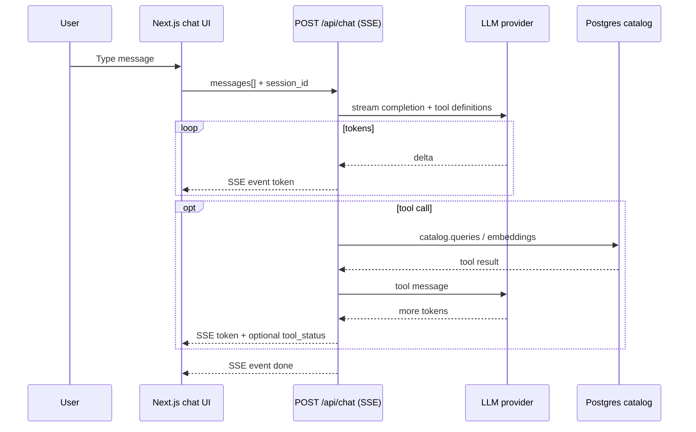

# Text chat (streaming)

The home-page **chat bar** should be **text in / text out** with **token streaming** (like a classic chatbot), not a link to `/voice`. Voice stays on **`/voice`** via LiveKit.

**Last updated:** 2026-09-26

---

## What exists today

| Piece | Role |
|--------|------|
| `agent/` + LiveKit | Voice pipeline (STT → LLM → TTS), tools on Python agent |
| `catalog/queries.py` | Postgres search, details, semantic search |
| `web/app/api/token` | LiveKit JWT only — **no chat** |

**Implemented:** `catalog/src/catalog/chat_api.py` (`catalog-chat-api`, default port **8765**), proxied by `web/app/api/chat/route.ts`. UI: `components/home/text-chat-panel.tsx`.

---

## Architecture



### Transport: **SSE** (simplest for Next.js)

- **Endpoint:** `POST /api/chat` (or separate Python service `POST /v1/chat`)
- **Response:** `Content-Type: text/event-stream`
- **Events** (suggested):
  - `token` — `{ "text": "..." }` partial assistant text
  - `tool_start` / `tool_end` — optional UI (“Searching catalog…”)
  - `error` — `{ "message": "..." }`
  - `done` — `{ "message_id": "..." }`

**Alternative:** WebSocket (`/api/chat/ws`) if you need bi-directional pings or very long sessions; SSE is enough for MVP.

---

## What to build (backend)

### 1. Shared tool layer (Python) — **reuse catalog**

Today tools live in `agent/src/game_tools.py` and depend on LiveKit `@function_tool`.

**Refactor (one-time):**

- Move core logic to `catalog/chat_tools.py` (plain functions returning strings).
- `agent/game_tools.py` wraps them for LiveKit.
- Chat API imports the same functions for OpenAI-style `tools` / function calling.

Tools to expose (same as voice):

| Tool | Catalog |
|------|---------|
| `search_games` | `catalog.queries.search_games` |
| `search_similar_games` | `embed_query_text` + `semantic_search_games` |
| `get_game_details` | `get_game_details` |
| `list_catalog_filters` | `list_supported_filters` |

**Env:** `DATABASE_URL`, `OPENAI_API_KEY` (embeddings + optional same LLM as chat).

### 2. Chat API service

**Option A — Next.js only (faster FE integration)**

- `web/app/api/chat/route.ts`
- Use **Vercel AI SDK** `streamText()` with tools, or raw OpenAI streaming.
- **Problem:** tool implementations are in **Python/catalog** today — you’d duplicate SQL in TS or call an internal Python service.

**Option B — Python service (recommended for this repo)**

- New package or module: `catalog/src/catalog/chat_api.py` + **`catalog-chat`** CLI / **uvicorn** app.
- **FastAPI** example routes:
  - `POST /v1/chat` — body: `{ "session_id": "...", "messages": [{"role":"user","content":"..."}] }`
  - Returns **SSE** stream.
- **LLM:** OpenAI `gpt-4o-mini` or same model family as voice (Gemma via LiveKit Inference only if you have an HTTP path; otherwise OpenAI for text chat is simplest).
- **Loop:** streaming completion → if `tool_calls`, run catalog tools → append tool results → stream again until finish.

**Option C — LiveKit text-only room**

- Connect from FE with **no mic**, use LiveKit **chat/data** to talk to the **same** deployed agent.
- Streaming = agent text chunks over LiveKit; **no new REST API**, but heavier client and still need token + agent worker for every text message.

For the **home widget**, **Option B** (or A with a thin Python sidecar) fits best.

### 3. Session & history

| MVP | Later |
|-----|--------|
| `session_id` (UUID) in cookie or localStorage; server keeps last N turns **in memory** or Redis | `chat_session` + `chat_message` tables in Postgres |
| No login | User auth + rate limits |

### 4. System prompt

Reuse `call_context.build_agent_instructions()` text (Game Guide persona, tool rules, no LiveKit mention). Single source: export a `GAME_GUIDE_SYSTEM_PROMPT` constant shared by voice + text.

### 5. Security & ops

- Never expose `DATABASE_URL` / `OPENAI_API_KEY` to the browser.
- Rate limit `POST /api/chat` (IP or session).
- Max message length, max turns per session.
- Log tool usage, not full PII.

---

## Frontend (for context)

| Component | Behavior |
|-----------|----------|
| Home chat bar | `ChatLauncher` opens **slide-up** `TextChatPanel` (not `/voice`) |
| `streamChat` | `lib/parse-chat-stream.ts` — `fetch('/api/chat')` + SSE line parser |
| Streaming UI | Assistant bubble grows with tokens; tool status optional |

---

## Run locally

Use **three terminals** from the repo root (`voice-agent/`), or absolute paths. Do not chain `cd catalog && …` and then `cd web` in one shell — after `cd catalog`, `web/` is not there.

```bash
# Terminal 1 — Postgres
docker compose up -d

# Terminal 2 — text chat API (:8765)
cd catalog && uv sync && uv run catalog-chat-api

# Terminal 3 — Next.js (:3000)
cd web && npm run dev
```

If you see **`address already in use` on 8765**, an API is already running (e.g. from a prior session). Either use it as-is and only start `npm run dev`, or free the port:

```bash
lsof -i :8765    # note PID
kill <PID>
```

Requires `OPENAI_API_KEY` and `DATABASE_URL` in repo `.env.local` (`CHAT_API_URL` optional for Next proxy).

---

## What you do **not** need for text chat

- LiveKit token or WebRTC for the home widget (only for `/voice`).
- New ingest jobs or embedding jobs (already done).
- Separate vector DB — keep pgvector in Postgres.

---

## Related

- [Frontend README](./README.md)
- [Database schema](../models/database-schema.md)
- Voice tools: `agent/src/game_tools.py`, `catalog/queries.py`
