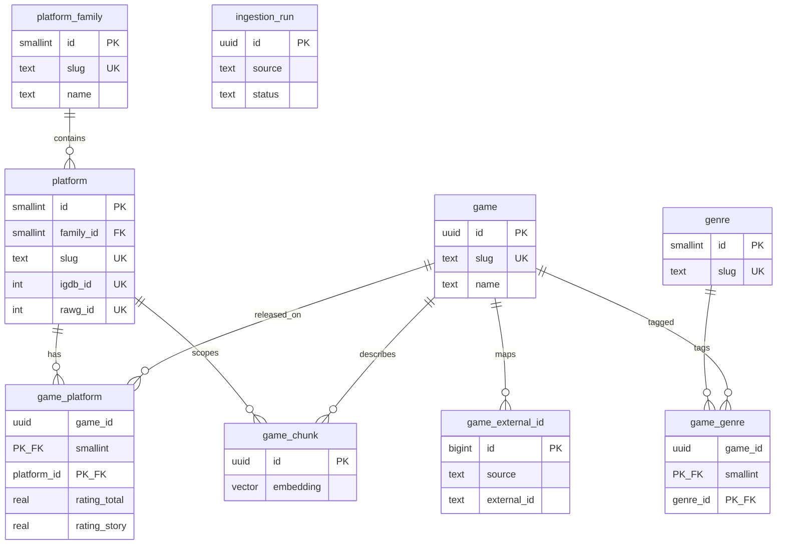

# Database schema — game catalog & recommendations

PostgreSQL **16** with **pgvector** (local: `docker compose up`, host port **5434** by default). SQL source of truth: `db/init/01_extensions.sql`, `db/init/02_schema.sql`. ORM: `catalog/` package.

**Purpose:** Store multi-platform game metadata (PlayStation, Xbox, PC/Steam, Nintendo, …), genres, per-platform scores, and optional text embeddings for semantic search. Voice agent tools query this database—not live IGDB/RAWG on every call.

**Last updated:** 2026-09-25

---

## Design goals

| Goal | How the schema supports it |
|------|----------------------------|
| **Platform versions** (PS2, PS5, Xbox 360, …) | `platform` rows with `family_id`, optional `igdb_id` / `rawg_id` |
| **Same game on many platforms** | One `game` row; many `game_platform` rows |
| **Category → recommend by rating** | `genre` + `game_genre`; sort on `game_platform` score columns |
| **Story / graphics / action / overall** | Dedicated nullable columns on `game_platform` (filled from APIs or derived later) |
| **External API sync** | `game_external_id`, `ingestion_run`, `last_synced_at` |
| **Future RAG / “tell me about this game”** | `game_chunk` + `embedding vector(1536)` |

**Out of scope for this schema (later):** LiveKit call records, contacts, transcripts, TypeSafe audit logs.

---

## Entity relationship (overview)



---

## Extensions

| Extension | Role |
|-----------|------|
| `pgcrypto` | `gen_random_uuid()` for primary keys |
| `vector` | `vector(1536)` on `game_chunk.embedding`; HNSW index for cosine similarity |

**Embedding dimension:** Fixed at **1536** in DDL. If you change embedding models (e.g. 768 or 3072), add a migration to alter column type and rebuild the HNSW index.

---

## Tables

### `platform_family`

Groups consoles for UI and ingest (PlayStation, Xbox, PC, Nintendo, …).

| Column | Type | Constraints | Description |
|--------|------|-------------|-------------|
| `id` | `SMALLSERIAL` | PK | Internal id |
| `slug` | `TEXT` | NOT NULL, UNIQUE | Stable key, e.g. `playstation` |
| `name` | `TEXT` | NOT NULL | Display name |
| `created_at` | `TIMESTAMPTZ` | NOT NULL, default `now()` | |

**Seed data:** `playstation`, `xbox`, `pc`, `nintendo`, `mobile`, `other`.

---

### `platform`

A specific hardware generation or primary distribution context (PS3, PS5, Xbox Series X\|S, PC Windows, …).

| Column | Type | Constraints | Description |
|--------|------|-------------|-------------|
| `id` | `SMALLSERIAL` | PK | Internal id |
| `family_id` | `SMALLINT` | FK → `platform_family(id)` ON DELETE SET NULL | Parent brand |
| `slug` | `TEXT` | NOT NULL, UNIQUE | e.g. `ps5`, `xbox-series-x`, `pc-windows` |
| `name` | `TEXT` | NOT NULL | Display name |
| `generation` | `SMALLINT` | nullable | Optional generation number (ingest from IGDB) |
| `igdb_id` | `INTEGER` | UNIQUE, nullable | IGDB `/platforms` id |
| `rawg_id` | `INTEGER` | UNIQUE, nullable | RAWG `/platforms` id |
| `created_at` | `TIMESTAMPTZ` | NOT NULL | |
| `updated_at` | `TIMESTAMPTZ` | NOT NULL | |

**Indexes:** `idx_platform_family_id` on `(family_id)`.

**Note:** “Steam” may be modeled as PC platform + `game_external_id` (`source = steam`) rather than a separate `platform` row. We can add `platform.slug = steam` later if recommendations must be Steam-specific.

---

### `genre`

Categories for voice flow (“pick Action, RPG, …”).

| Column | Type | Constraints | Description |
|--------|------|-------------|-------------|
| `id` | `SMALLSERIAL` | PK | |
| `slug` | `TEXT` | NOT NULL, UNIQUE | e.g. `role-playing` |
| `name` | `TEXT` | NOT NULL | Display name |
| `igdb_id` | `INTEGER` | UNIQUE, nullable | |
| `rawg_id` | `INTEGER` | UNIQUE, nullable | |

---

### `game`

Canonical title (one row per game concept, not per platform SKU).

| Column | Type | Constraints | Description |
|--------|------|-------------|-------------|
| `id` | `UUID` | PK, default `gen_random_uuid()` | |
| `slug` | `TEXT` | NOT NULL, UNIQUE | URL-safe unique key |
| `name` | `TEXT` | NOT NULL | Title |
| `summary` | `TEXT` | nullable | Short description (IGDB/RAWG) |
| `storyline` | `TEXT` | nullable | Longer narrative blurb when available |
| `first_release_date` | `DATE` | nullable | Global or earliest release |
| `created_at` | `TIMESTAMPTZ` | NOT NULL | |
| `updated_at` | `TIMESTAMPTZ` | NOT NULL | |

**Indexes:** `idx_game_name_lower` on `lower(name)` for case-insensitive lookup.

---

### `game_external_id`

Maps our `game` to upstream identifiers (many sources per game).

| Column | Type | Constraints | Description |
|--------|------|-------------|-------------|
| `id` | `BIGSERIAL` | PK | |
| `game_id` | `UUID` | NOT NULL, FK → `game(id)` CASCADE | |
| `source` | `TEXT` | NOT NULL | e.g. `igdb`, `rawg`, `steam`, `metacritic` |
| `external_id` | `TEXT` | NOT NULL | Opaque id string (Steam appid, IGDB game id, …) |

**Unique:** `(source, external_id)` — one global row per external record.

**Indexes:** `idx_game_external_id_game` on `(game_id)`.

---

### `game_genre`

Many-to-many: games can have multiple genres.

| Column | Type | Constraints |
|--------|------|-------------|
| `game_id` | `UUID` | PK, FK → `game(id)` CASCADE |
| `genre_id` | `SMALLINT` | PK, FK → `genre(id)` CASCADE |

**Indexes:** `idx_game_genre_genre` on `(genre_id)` for “all RPGs” queries.

---

### `game_platform`

**Core table for recommendations:** release and scores **per platform**.

| Column | Type | Constraints | Description |
|--------|------|-------------|-------------|
| `game_id` | `UUID` | PK, FK → `game(id)` CASCADE | |
| `platform_id` | `SMALLINT` | PK, FK → `platform(id)` CASCADE | |
| `release_date` | `DATE` | nullable | Release on this platform |
| `store_url` | `TEXT` | nullable | PS Store, Steam, etc. |
| `rating_user` | `REAL` | nullable | User/community score (normalized 0–100 or 0–10 — document per ingest) |
| `rating_critic` | `REAL` | nullable | Critic / aggregated critic score |
| `rating_total` | `REAL` | nullable | Blended or primary sort score |
| `metacritic_score` | `SMALLINT` | nullable | 0–100 when from Metacritic |
| `rating_story` | `REAL` | nullable | Derived or manual “storyline” dimension |
| `rating_graphics` | `REAL` | nullable | Derived or manual “graphics” dimension |
| `rating_action` | `REAL` | nullable | Derived or manual “action” dimension |
| `rawg_rating` | `REAL` | nullable | RAWG-specific rating copy |
| `last_synced_at` | `TIMESTAMPTZ` | nullable | Last ingest touch for this row |
| `source` | `TEXT` | nullable | Last writer, e.g. `igdb_sync_v1` |

**Primary key:** `(game_id, platform_id)`.

**Indexes:**

- `idx_game_platform_platform_total` — `(platform_id, rating_total DESC NULLS LAST)` for “best overall on PS5”
- `idx_game_platform_platform_critic` — `(platform_id, rating_critic DESC NULLS LAST)`

**Typical recommendation query (conceptual):**

```sql
SELECT g.name, gp.rating_total
FROM game g
JOIN game_platform gp ON gp.game_id = g.id
JOIN game_genre gg ON gg.game_id = g.id
JOIN genre gr ON gr.id = gg.genre_id
WHERE gp.platform_id = :platform_id
  AND gr.slug = :genre_slug
ORDER BY gp.rating_story DESC NULLS LAST  -- or rating_total, rating_graphics, …
LIMIT 3;
```

---

### `game_chunk`

Optional semantic index: chunked text + embedding for RAG or hybrid search.

| Column | Type | Constraints | Description |
|--------|------|-------------|-------------|
| `id` | `UUID` | PK | |
| `game_id` | `UUID` | NOT NULL, FK → `game(id)` CASCADE | |
| `platform_id` | `SMALLINT` | FK → `platform(id)` SET NULL, nullable | Scope chunk to a platform if needed |
| `chunk_index` | `INTEGER` | NOT NULL, default 0 | Order within game (+ platform) |
| `content` | `TEXT` | NOT NULL | Chunk text |
| `metadata` | `JSONB` | NOT NULL, default `{}` | Source page, field name, language, etc. |
| `embedding` | `vector(1536)` | nullable | Filled after embed job |
| `created_at` | `TIMESTAMPTZ` | NOT NULL | |

**Unique:** `(game_id, platform_id, chunk_index)` — note `NULL` platform_id allows one “global” chunk set per game.

**Indexes:**

- `idx_game_chunk_game` on `(game_id)`
- `idx_game_chunk_embedding_hnsw` — HNSW, `vector_cosine_ops`

---

### `ingestion_run`

Audit trail for sync jobs (IGDB pull, RAWG pull, Metacritic enrich, …).

| Column | Type | Constraints | Description |
|--------|------|-------------|-------------|
| `id` | `UUID` | PK | |
| `source` | `TEXT` | NOT NULL | e.g. `igdb`, `rawg`, `steam` |
| `status` | `TEXT` | NOT NULL, default `running` | `running`, `success`, `failed` |
| `started_at` | `TIMESTAMPTZ` | NOT NULL | |
| `finished_at` | `TIMESTAMPTZ` | nullable | |
| `stats` | `JSONB` | NOT NULL, default `{}` | Counts: inserted, updated, errors |
| `error_message` | `TEXT` | nullable | |

**Indexes:** `idx_ingestion_run_source_started` on `(source, started_at DESC)`.

---

## Rating scale convention (to agree in ingest)

APIs use different scales. **Pick one normalized scale in application layer** (recommended: **0–100** for voice-friendly comparison) and document in ingest code.

| Field | Typical upstream |
|-------|------------------|
| `rating_critic` | IGDB `aggregated_rating`, Metacritic metascore |
| `rating_user` | IGDB `rating`, RAWG rating, Metacritic user (0–10 → scale) |
| `rating_total` | IGDB `total_rating` or computed blend |
| `rating_story` / `graphics` / `action` | Not from APIs directly — proxies, NLP, or editorial |

---

## Open design questions (for discussion)

1. **Steam as platform vs external id** — Separate `platform` row for Steam, or PC + `game_external_id.source = steam` only?
2. **Genre per platform** — Some genres differ by region; is `game_genre` global enough?
3. **Duplicate games** — Same title different year: merge via IGDB id or separate `game` rows?
4. **Partial unique on `game_chunk`** — With `platform_id` NULL, multiple chunks share `(game_id, NULL, chunk_index)`; is that the intended pattern?
5. **Voice agent tables** — Add `conversation_session`, `recommendation_event` later, or keep agent stateless?
6. **`pg_trgm`** — Add extension + GIN index for fuzzy title search during ingest dedup?

---

## Migrations

Today, schema is applied only via **Docker init scripts** on first volume create. After you change production data:

- Add numbered files under `db/migrations/` (or use Alembic/Flyway), **or**
- `docker compose down -v` for local reset (destroys data).

---

## Python ORM (`catalog` package)

| Path | Purpose |
|------|---------|
| `catalog/src/catalog/models.py` | SQLAlchemy 2.0 models (mirrors this schema) |
| `catalog/src/catalog/database.py` | Engine + session factory (`DATABASE_URL`) |
| `catalog/src/catalog/cli.py` | `catalog-db create` — extensions + `create_all` |

```bash
cd catalog && uv sync
docker compose up -d    # from repo root
uv run catalog-db create
```

## Related docs

- Data sources: `docs/research/game-data-sources.md`
- Docker: `docker-compose.yml` at repo root
